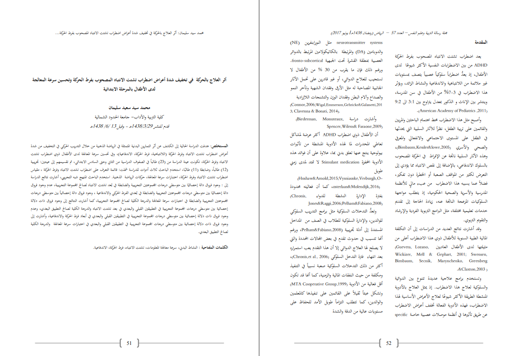

# Mistral OCR - Advanced PDF Processing & Audio Transcription

## 🌍 مقدمة باللغة العربية

هذا المشروع يوفر سكريبتات Python متقدمة للتفاعل مع Mistral AI API لمعالجة OCR لملفات PDF، مع إمكانيات المعالجة الدفعية وتتبع التكاليف. يدعم النظام معالجة النصوص العربية والمستندات متعددة اللغات بكفاءة عالية، بالإضافة إلى تحويل الصوت إلى نص باستخدام نماذج Voxtral المتقدمة.

This project provides advanced Python scripts for OCR processing, PDF text extraction, audio transcription, and document processing using Mistral AI API. Features batch processing, cost tracking, multilingual support, and speech-to-text capabilities.

## 📸 Example Input & Output Screenshots



### Example Output Files
See the example output screenshots in the `screenshot/` directory with `input.png`, `output1.png`, and `output2.png` showing Arabic text processing results.
```markdown
محمد سيد سليمان: أثر العلاج بالحركة في تخفيف شدة أعراض اضطراب تشتت الانتباه المصحوب بفرط الحركة وتحسين سرعة المعالجة لدى الأطفال بالمرحلة الابتدائية

محمد سيد سعيد سليمان<br>كلية التربية والآداب- جامعة الحدود الشمالية<br>قدم المنشر 1438/3/29هـ - وفيل 13 /6/ 1438م

المستخلص: هدفت الدراسة الحالية إلى الكشف عن أثر التمارين البدنية المتمثلة في الرياضة الذهنية من خلال التدريب الحركي في التخفيف من شدة أعراض اضطراب تشتت الانتباه وفرط الحركة (اللانتباهية، فرط الحركة، الاندفاعية)، وفي تحسين سرعة المعالجة لدى الأطفال ذوي اضطراب تشتت الانتباه وفرط الحركة، تكونت عينة الدراسة من (23) طالباً في الصفوف الدراسية من الثاني وحتى السادس الابتدائي، ثم تقسيمهم إلى عينتين: تجريبية (12) طالباً، وضابطة (11) طالبًا، استخدم الباحث ثلاث أدوات للدراسة شملت: قائمة التعرف على اضطراب تشتت الانتباه وفرط الحركة ، مقياس اضطراب تشتت الانتباه وفرط الحركة، اختبارات سرعة المعالجة، حركات الرياضة الذهنية. استخدم الباحث المنهج شبه التجريبي، أشارت نتائج الدراسة إلى : وجود فروق دالة إحصائيًا بين متوسطي درجات المحموعتين التجريبية والضابطة في بُعد تشتت الانتباه لصالح المحموعة التجريبية، عدم وجود فروق دالة إحصائيًا بين متوسطي درجات المحموعتين التجريبية والضابطة في بُعدي الفرط الحركي والاندفاعية ، وجود فروق دالة إحصائياً بين متوسطي درجات المحموعتين التجريبية والضابطة في اختبارات سرعة المعالجة والدرجة الكلية لصالح المحموعة التجريبية، كما أشارت النتائج إلى وجود فروق ذات دلالة إحصائية بين متوسطي درجات المحموعة التجريبية في التطبيقين القبلي والبعدي في بعد تشتت الانتباه والدرجة الكلية لصالح التطبيق البعدي، وعدم وجود فروق ذات دلالة إحصائية بين متوسطي درجات المحموعة التجريبية في التطبيقين القبلي والبعدي في أبعاد فرط الحركة والاندفاعية، وأشارت إلى وجود فروق ذات دلالة إحصائية بين متوسطي درجات المحموعة التجريبية في التطبيقين القبلي والبعدي في اختبارات سرعة المعالجة والدرجة الكلية لصالح التطبيق البعدي.

الكلمات المفتاحية : النشاط البدني، سرعة معالجة المعلومات، تشتت الانتباه، فرط الحركة، الاندفاعية.

 المقدمة 

يعد اضطراب تشتت الانتباه المصحوب بفرط الحركة ADHD من بين الاضطرابات النفسية الأكثر شيوعًا لدى الأطفال، إذ يعدٌّ اضطراباً سلوكياً عصبياً يتصف بمستويات غير ملائمة من اللانتباهية والاندفاعية والنشاط الزائد، ويؤثر هذا الاضطراب في 3-7\% من الأطفال في سن المدرسة، وينتشر بين الإناث و الذكور بمعدل يتراوح بين 3:1 الى 9:2 (2011, American Academy of Pediatrics).

وأصبح مثل هذا الاضطراب محط اهتمام الباحثين والمربين والقائمين على تربية الطفل، نظراً للآثار السلبية التي يحدثها في الطفل على المستوى الاجتماعي والانفعالي والمعرفي والصحي والأسري (Birmbaum,Kessler\&lowe,2005)، وهذه الآثار السلبية ناتجة عن الإفراط في الحركة المصحوب بالسلوك الاندفاعي، بالإضافة إلى نقص الانتباه مما يؤدي إلى التعرض لكثير من المواقف الصعبة أو الخطرة دون تفكير، فضلاً عما يسببه هذا الاضطراب من عبء ماليٍ للأنظمة المدرسية والأسرية والصحية الحكومية، إذ يتطلب مواجهة السلوكيات المزعجة الناتجة عنه، زيادة الحاجة إلى تقديم خدمات تعليمية مختلفة، مثل البرامج التربوية الفردية والإرشاد والتقويم التربوي.

وقد أشارت نتائج العديد من الدراسات إلى أن التكلفة المالية الطبية السنوية للأطفال ذوي هذا الاضطراب أعلى من مثيلتها لدى الأطفال العاديين (Guevera, Lozano, Wickizer, Mell \& Gephart, 2001; Swensen, Birnbaum, Secnik, Marynhenko, Greenberg \& Claxton,2003).

وتستخدم برامج علاجية عديدة تتنوع بين الدوائية والسلوكية لعلاج هذا الاضطراب. إذ يمثل العلاج بالأدوية المنشطة الطريقة الأكثر شيوعًا لعلاج الأعراض الأساسية لهذا الاضطراب، فهذه الأدوية الفعالة تخفف أعراض الاضطراب عن طريق تأثيرها في أنظمة موصلات عصبية خاصة specific

 (NE)

والدوبامين (DA) والمرتبطة بالكاثيكولامين المرتبط بالدوائر العصبية بمنطقة القشرة تحت الجبهية fronto-subcortical. ورغم ذلك فإن ما يقرب من $30 \%$ من الأطفال لا تستجيب للعلاج الدوائي، أو غير قادرين على تحمل الآثار الجانبية المصاحبة له مثل الأرق وفقدان الشهية وتأخر النمو والصداع وآلام البطن وفقدان الوزن والتش痉ات اللاإرادية (Connor,2006;Wigal,Emmerson,Gehricke\&Galassetti,200 (Connor,2006;Wigal,Emmerson,Gehricke\&Galassetti,200) (2014 ,2011).

وأشارت دراسة (Biederman, Monuteaux, Spencer,Wilens\& Faraone,2009) أن الأطفال ذوي اضطراب ADHD أكثر عرضة لمشاكل تعاطي المخدرات لما لهذه الأدوية المنشطة من تأثيرات بيولوجية ينتج عنها تعلق بدني بها، علاوة على أن فوائد هذه الأدوية المحفزة Stimulant medication لا تمتد لمدى زمني طويل
(Hnshaw\&Arnold,2015;Vysniauske,Verburgh,O- (osterlaan\&Molendijk,2016، كما أن فعاليته محدودة بفترة الإدارة النشطة للدواء Chronis, Jones\&Raggi,2006;Pelham\&Fabiano,2008) وتعدُّ التدخلات السلوكية مثل برامج التدريب السلوكي للوالدين، والإدارة السلوكية للطلاب في الصف من المداخل المستندة إلى أدلة تجريبية (Pelham\&Fabiano,2008، ورغم أنها تتسبب في حدوث تقدمٍ في بعض المجالات المحددة والتي لا يصلح لها العلاج الدوائي إلا أن هذا التقدم يعب استمراره بعد انتهاء فترة التدخل السلوكي (Chronis,et al., 2006)، أكثر من ذلك التدخلات السلوكية صعبة نسبياً في التنفيذ ومكلفة من حيث النفقات المالية والزمنية، كما أنها قد تكون أقل فعالية من الأدوية (MTA Cooperative Group,1999) وتشكل عبثاً ثقيلاً على القائمين على تنفيذها كالمعلمين والوالدين، كما تتطلب التزاماً طويل الأمد للحفاظ على مستويات عالية من الدقة والشدة

```

### 📝 Editing Arabic Markdown
For editing Arabic markdown content, use the online Arabic markdown editor at https://app.dawin.io/ - "الآن محرّر دوّن بحلّة جديدة , وتجربة لم تعهدها من قبل , ميزات عديدة بانتظارك! دَوِّن، هو محرّر نصوص عربي لتنسيقات ماركداون (Markdown) صمّم لحلّ مشكلة عدم توفر أي محرر نصوص متقدم يدعم اللغة العربية والاتجاه (Right to left). طوّر بأياد عربية خالصة تكّن للغة العربية احتراما وإجلالًا."


## 🚀 `pdf_to_txt_new.py` - Advanced PDF OCR Converter

**Enhanced PDF to Text/Markdown converter with batch processing, URL support, automatic dependency management, and smart file management.**

### ✨ Key Features

- **📄 Flexible Output Formats**: Default plain text (`.txt`) or markdown (`.md`) with `--md` flag
- **🌐 URL Support**: Download and process PDFs directly from URLs with auto-cleanup
- **🔄 Batch Processing**: Process single files or entire directories recursively
- **🧠 Smart Skip Logic**: Only skips PDFs with existing files of the target extension
- **🔄 Re-processing**: Interactive confirmation for single file re-processing with unique naming
- **🔑 Custom API Key**: Use `--api-key` parameter or environment variable
- **♻️ Auto-Cleanup**: Downloaded PDFs are deleted after OCR unless `--keep` flag is used
- **📦 Dependency Checking**: Automatically checks and offers to install missing packages
- **📁 Recursive Directory Support**: Processes PDFs in all subdirectories
- **📂 In-Place Processing**: Outputs files to the same location as source PDFs

### 📋 Usage Examples

#### Single File Processing

```bash
# Process to plain text (default)
python pdf_to_txt_new.py document.pdf

# Process to markdown
python pdf_to_txt_new.py document.pdf --md

# Explicit plain text
python pdf_to_txt_new.py document.pdf --txt

# Use custom API key
python pdf_to_txt_new.py document.pdf --api-key your_api_key_here
```

#### URL Processing

```bash
# Download and process PDF from URL (auto-cleanup)
python pdf_to_txt_new.py --url https://example.com/document.pdf

# Download and convert to markdown
python pdf_to_txt_new.py --url https://example.com/document.pdf --md

# Download and keep the PDF file after OCR
python pdf_to_txt_new.py --url https://example.com/document.pdf --keep
```

#### Directory Processing

```bash
# Process all PDFs in directory (recursive) to text
python pdf_to_txt_new.py ./documents/

# Process all PDFs to markdown
python pdf_to_txt_new.py ./documents/ --md
```

### 🎯 Processing Behavior

#### Directory Mode

- Recursively finds all `*.pdf` files
- **Smart Skip Logic**: Only skips PDFs with existing files of the **target extension**
  - Example: If `file.txt` exists and you run with `--md`, it will still process
- Shows progress: `"Skipping 3 PDF(s) with existing .txt files, 2 remaining"`
- Processes only new files or files without target extension
- **Outputs files to the same directory as the source PDFs**

#### Single File Mode

- Checks if PDF has output file with **target extension only**
  - Example: If `file.txt` exists and you run with `--md`, no confirmation needed
- Asks for confirmation only when target extension file exists
- Creates uniquely named outputs: `document_1.txt`, `document_2.md`, etc.
- **Outputs the file to the same directory as the source PDF**

#### URL Mode

- Downloads PDF from URL to current directory
- Processes downloaded PDF like a local file
- **Auto-cleanup**: Deletes downloaded PDF after OCR (unless `--keep` flag is used)
- Maintains all other processing features

### 📦 Automatic Dependency Management

The script automatically checks for required packages and offers to install them:

```text
======================================================================
ERROR: Missing required packages
======================================================================
  ✗ python-dotenv
  ✗ mistralai

To install missing packages, run one of these commands:
  pip install python-dotenv mistralai
  pip install -r requirements.txt

Would you like to install them now? (y/N):
```

**Features:**
- ✅ Automatic detection of missing packages
- ✅ Interactive installation prompt
- ✅ Clear installation instructions
- ✅ Safe permission-based installation
- ✅ Silent operation when packages are installed

### 📁 Output Structure

```text
your_directory/
├── pdf_to_txt_new.py
├── documents/
│   ├── report.pdf
│   ├── report.txt                   # Default: plain text output
│   ├── data.pdf
│   └── data.md                      # With --md flag
└── subfolder/
    ├── analysis.pdf
    ├── analysis.txt                 # Default output
    └── downloaded_document.pdf      # URL downloads (deleted unless --keep)
```

**Output Format Examples:**
- `python pdf_to_txt_new.py doc.pdf` → `doc.txt` (default)
- `python pdf_to_txt_new.py doc.pdf --md` → `doc.md`
- `python pdf_to_txt_new.py --url https://example.com/file.pdf` → `file.txt` (PDF deleted after)
- `python pdf_to_txt_new.py --url https://example.com/file.pdf --keep` → `file.txt` + `file.pdf` (kept)

### 🎛️ Command Line Options

```bash
python pdf_to_txt_new.py [input] [options]

Arguments:
  input                 Path to PDF file or directory (optional with --url)

Options:
  --url URL            Download and process PDF from URL
  --md                 Convert to markdown instead of plain text
  --txt                Explicitly convert to plain text (default)
  --api-key KEY        Use custom Mistral API key
  --keep               Keep downloaded PDF file after processing
  --model MODEL        OCR model name (default: mistral-ocr-latest)
  -h, --help           Show help message
```

**Common Use Cases:**

| Command | Description |
|---------|-------------|
| `pdf_to_txt_new.py file.pdf` | Process to plain text (default) |
| `pdf_to_txt_new.py file.pdf --md` | Process to markdown |
| `pdf_to_txt_new.py --url https://example.com/doc.pdf` | Download, OCR, delete PDF |
| `pdf_to_txt_new.py --url URL --keep` | Download, OCR, keep PDF |
| `pdf_to_txt_new.py ./docs/` | Process all PDFs in directory |
| `pdf_to_txt_new.py file.pdf --api-key KEY` | Use custom API key |

## 📄 `pdf_to_txt.py` - Basic PDF OCR Converter

**Legacy single-file PDF to text converter.**

### Usage

```bash
python pdf_to_txt.py <path_to_pdf_file>
```

## 🎵 `transcribe_audio.py` - Audio Transcription Tool

**Advanced audio file transcription using Mistral AI's Voxtral models for high-quality speech-to-text conversion.**

### ✨ Key Features

- **🎯 High-Quality Transcription**: Uses Mistral's Voxtral models for accurate speech recognition
- **🌍 Multilingual Support**: Supports multiple languages including Arabic, English, and more
- **📁 Simple File Processing**: Process any audio file with automatic text output
- **🔧 Command-Line Interface**: Easy-to-use CLI with file path input
- **📝 Automatic Output**: Saves transcription to `.txt` file with same base name
- **🛡️ Error Handling**: Comprehensive error handling with user-friendly messages

### 📋 Usage Examples

#### Single Audio File Transcription

```bash
# Basic usage - transcribe any audio file
python transcribe_audio.py audio.ogg
python transcribe_audio.py recording.mp3
python transcribe_audio.py speech.wav
```

### 🎯 Processing Behavior

- **Input**: Any audio file (`.ogg`, `.mp3`, `.wav`, `.m4a`, `.flac`, etc.)
- **Output**: Creates a `.txt` file with the same base name in the same directory
- **Model**: Uses `voxtral-mini-latest` for optimal transcription quality
- **Encoding**: UTF-8 encoding for proper multilingual text support

### 📁 Output Example

```
your_directory/
├── transcribe_audio.py
├── speech.ogg
└── speech.txt              # Transcription output
```

## 🛠️ Setup

1. **Clone the repository:**
   ```bash
   git clone https://github.com/EngDawood/mistral-ocr.git
   cd mistral-ocr
   ```

2. **Install dependencies:**
   ```bash
   pip install -r requirements.txt
   ```

3. **Get your free Mistral API key:**
   - Visit [Mistral AI Console](https://console.mistral.ai/api-keys)
   - Sign up for a free account
   - Navigate to API Keys section
   - Create a new API key
   - Copy the API key (keep it secure)

4. **Set up your API key:**
   Copy the example environment file and fill in your API key:
   ```bash
   cp .env.example .env
   ```

   Then edit `.env` with your actual Mistral API key:
   ```
   MISTRAL_API_KEY=your_actual_api_key_here
   ```

## 📋 Requirements

- Python 3.8+
- Mistral AI API key (get free at [console.mistral.ai](https://console.mistral.ai/api-keys))
- Required packages: `mistralai`, `python-dotenv` (auto-checked by `pdf_to_txt_new.py`)

## 🔗 Mistral OCR API Information

**Free Tier**: Mistral offers general OCR processing for up to 1,000 pages for free.

**API Limitations**:
- Uploaded document files must not exceed 50 MB in size
- Documents should be no longer than 1,000 pages

**OCR Resources & Cookbooks**:
- [Tool Usage Guide](https://colab.research.google.com/github/mistralai/cookbook/blob/main/mistral/ocr/tool_usage.ipynb)
- [Batch OCR Guide](https://colab.research.google.com/github/mistralai/cookbook/blob/main/mistral/ocr/batch_ocr.ipynb)

## 🌍 Arabic Language Support

This project fully supports Arabic text processing and multilingual documents. The system has been tested with:

- **Mixed Arabic and English texts**
- **UTF-8 encoding for Arabic content**
- **Proper right-to-left text direction handling**

### 📝 Important Notes for Arabic Users

- Ensure PDF files are saved with UTF-8 encoding
- The system preserves correct Arabic text ordering
- Multilingual documents can be processed efficiently
- Arabic README available: [README_ar.md](README_ar.md)

## 🤝 Contributing

Pull requests are welcome. For major changes, please open an issue first to discuss what you would like to change.

## 📄 License

This project is open source. Please check the license file for details.
