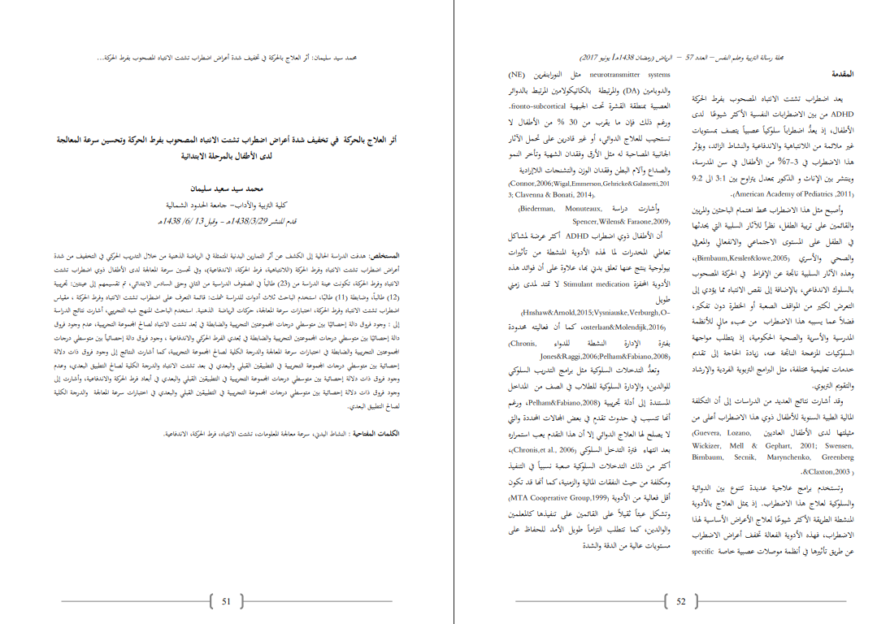

# Mistral OCR - معالجة PDF المتقدمة وتحويل الصوت إلى نص

هذا المشروع يوفر سكريبتات Python متقدمة لمعالجة OCR، استخراج نص PDF، تحويل الصوت إلى نص، ومعالجة المستندات باستخدام Mistral AI API. يتضمن معالجة دفعية، تتبع التكاليف، دعم متعدد اللغات، وإمكانيات تحويل الكلام إلى نص.

## 📸 أمثلة على الإدخال والإخراج

إليك أمثلة على نتائج معالجة OCR من مستند PDF باللغة العربية. تتمكن الأداة من استخراج النص العربي وتحويله إلى تنسيق Markdown مع الحفاظ على هيكل المحتوى وتنسيقه الأصلي. هذا يُظهر قدرة الأداة على التعامل مع المستندات باللغة العربية بشكل فعال.


### أمثلة على ملفات الإخراج
انظر إلى لقطات الشاشة في دليل `screenshot/` مع `input.png` و `output1.png` و `output2.png` التي تظهر نتائج معالجة النصوص العربية.
```markdown
محمد سيد سليمان: أثر العلاج بالحركة في تخفيف شدة أعراض اضطراب تشتت الانتباه المصحوب بفرط الحركة وتحسين سرعة المعالجة لدى الأطفال بالمرحلة الابتدائية

محمد سيد سعيد سليمان<br>كلية التربية والآداب- جامعة الحدود الشمالية<br>قدم المنشر 1438/3/29هـ - وفيل 13 /6/ 1438م

المستخلص: هدفت الدراسة الحالية إلى الكشف عن أثر التمارين البدنية المتمثلة في الرياضة الذهنية من خلال التدريب الحركي في التخفيف من شدة أعراض اضطراب تشتت الانتباه وفرط الحركة (اللانتباهية، فرط الحركة، الاندفاعية)، وفي تحسين سرعة المعالجة لدى الأطفال ذوي اضطراب تشتت الانتباه وفرط الحركة، تكونت عينة الدراسة من (23) طالباً في الصفوف الدراسية من الثاني وحتى السادس الابتدائي، ثم تقسيمهم إلى عينتين: تجريبية (12) طالباً، وضابطة (11) طالبًا، استخدم الباحث ثلاث أدوات للدراسة شملت: قائمة التعرف على اضطراب تشتت الانتباه وفرط الحركة ، مقياس اضطراب تشتت الانتباه وفرط الحركة، اختبارات سرعة المعالجة، حركات الرياضة الذهنية. استخدم الباحث المنهج شبه التجريبي، أشارت نتائج الدراسة إلى : وجود فروق دالة إحصائيًا بين متوسطي درجات المحموعتين التجريبية والضابطة في بُعد تشتت الانتباه لصالح المحموعة التجريبية، عدم وجود فروق دالة إحصائيًا بين متوسطي درجات المحموعتين التجريبية والضابطة في بُعدي الفرط الحركي والاندفاعية ، وجود فروق دالة إحصائياً بين متوسطي درجات المجمم
```



### 📝 تحرير الماركداون العربي
لتحرير محتوى الماركداون العربي، استخدم محرر الماركداون العربي عبر الإنترنت على https://app.dawin.io/ - "الآن محرّر دوّن بحلّة جديدة , وتجربة لم تعهدها من قبل , ميزات عديدة بانتظارك! دَوِّن، هو محرّر نصوص عربي لتنسيقات ماركداون (Markdown) صمّم لحلّ مشكلة عدم توفر أي محرر نصوص متقدم يدعم اللغة العربية والاتجاه (Right to left). طوّر بأياد عربية خالصة تكّن للغة العربية احتراما وإجلالًا."

## 🚀 `pdf_to_txt_new.py` - محول PDF إلى Markdown المتقدم

**محول PDF إلى Markdown محسن مع المعالجة الدفعية، تتبع التكاليف، وإدارة الملفات الذكية.**

### ✨ الميزات الرئيسية

- **🔄 المعالجة الدفعية**: معالجة ملف واحد أو مجلدات كاملة بشكل متكرر
- **💰 تتبع التكاليف**: حساب تلقائي للتكاليف (0.001 دولار لكل صفحة) مع تسجيل CSV مفصل
- **🧠 منطق التخطي الذكي**: تخطي تلقائي لملفات PDF المعالجة مسبقاً
- **🔄 إعادة المعالجة**: تأكيد تفاعلي لإعادة معالجة ملف واحد مع تسمية فريدة
- **📁 دعم المجلدات المتكرر**: معالجة ملفات PDF في جميع المجلدات الفرعية
- **📂 معالجة في المكان**: معالجة الملفات من أي مجلد وإخراج ملفات Markdown إلى نفس الموقع
- **📊 تسجيل شامل**: تتبع اسم الملف، الصفحات، الطوابع الزمنية، التكاليف، ومسارات الإخراج

### 📋 أمثلة الاستخدام

#### معالجة ملف واحد

```bash
# الاستخدام الأساسي
python pdf_to_txt_new.py document.pdf

# مع تتبع مخصص
python pdf_to_txt_new.py document.pdf --track-file my_log.csv --track-format csv
```

#### معالجة مجلد

```bash
# معالجة جميع ملفات PDF في المجلد (متكرر)
python pdf_to_txt_new.py ./documents/

# معالجة مع تتبع مخصص
python pdf_to_txt_new.py ./pdfs --track-file batch_log.txt --track-format txt
```

### 🎯 سلوك المعالجة

#### وضع المجلد

- البحث المتكرر عن جميع ملفات `*.pdf`
- تخطي ملفات PDF التي تحتوي على ملفات `.md` مقابلة
- عرض التقدم: `"تخطي 3 ملفات PDF معالجة مسبقاً، 2 متبقية"`
- معالجة الملفات الجديدة فقط
- **إخراج ملفات Markdown إلى نفس المجلد كملفات PDF المصدر**

#### وضع الملف الواحد

- التحقق من معالجة PDF مسبقاً
- طلب التأكيد: `"تم معالجة الملف 'document.pdf' مسبقاً. إعادة معالجته؟ (y/N):"`
- إنشاء مخرجات بأسماء فريدة: `document_1.md`, `document_2.md`, إلخ.
- **إخراج ملف Markdown إلى نفس المجلد كملف PDF المصدر**

### 📊 تتبع التكاليف

**ملف التتبع التلقائي**: `ocr_usage_tracking.csv` (يتم إنشاؤه بجانب السكريبت)

```csv
filename,page_count,processing_date,cost_usd,output_path
document.pdf,6,2025-10-24T22:30:38,0.0060,/path/document.md
batch_file.pdf,25,2025-10-24T22:31:15,0.0250,/path/batch_file.md
```

**حساب التكلفة**: `0.001 دولار × عدد_الصفحات`
- 6 صفحات = 0.0060 دولار
- 100 صفحة = 0.1000 دولار
- 1000 صفحة = 1.0000 دولار

### 📁 هيكل الإخراج

```
your_directory/
├── pdf_to_txt_new.py
├── ocr_usage_tracking.csv          # تتبع التكاليف التلقائي
├── documents/
│   ├── report.pdf
│   ├── report.md                    # إخراج OCR (نفس المجلد)
│   ├── data.pdf
│   └── data.md                      # إخراج OCR (نفس المجلد)
└── subfolder/
    ├── analysis.pdf
    └── analysis.md                  # إخراج OCR (نفس المجلد)
```

## 📄 `pdf_to_txt.py` - محول PDF إلى نص أساسي

**محول PDF إلى نص أساسي لملف واحد.**

### الاستخدام

```bash
python pdf_to_txt.py <path_to_pdf_file>
```

## 🎵 `transcribe_audio.py` - أداة تحويل الصوت إلى نص

**أداة تحويل الصوت المتقدمة باستخدام نماذج Voxtral من Mistral AI لتحويل عالي الجودة من الكلام إلى النص.**

### ✨ الميزات الرئيسية

- **🎯 تحويل عالي الجودة**: يستخدم نماذج Voxtral من Mistral للتعرف الدقيق على الكلام
- **🌍 دعم متعدد اللغات**: يدعم عدة لغات بما في ذلك العربية، الإنجليزية، والمزيد
- **📁 معالجة ملفات بسيطة**: معالجة أي ملف صوتي مع إخراج نصي تلقائي
- **🔧 واجهة سطر الأوامر**: واجهة CLI سهلة الاستخدام مع إدخال مسار الملف
- **📝 إخراج تلقائي**: حفظ التحويل إلى ملف `.txt` بنفس الاسم الأساسي
- **🛡️ معالجة الأخطاء**: معالجة شاملة للأخطاء مع رسائل ودية للمستخدم

### 📋 أمثلة الاستخدام

#### تحويل ملف صوتي واحد

```bash
# الاستخدام الأساسي - تحويل أي ملف صوتي
python transcribe_audio.py audio.ogg
python transcribe_audio.py recording.mp3
python transcribe_audio.py speech.wav
```

### 🎯 سلوك المعالجة

- **الإدخال**: أي ملف صوتي (`.ogg`, `.mp3`, `.wav`, `.m4a`, `.flac`, إلخ)
- **الإخراج**: إنشاء ملف `.txt` بنفس الاسم الأساسي في نفس المجلد
- **النموذج**: يستخدم `voxtral-mini-latest` لجودة التحويل المثلى
- **الترميز**: ترميز UTF-8 لدعم النصوص متعددة اللغات بشكل صحيح

### 📁 مثال الإخراج

```
your_directory/
├── transcribe_audio.py
├── speech.ogg
└── speech.txt              # إخراج التحويل
```

## 🛠️ الإعداد

1. **استنساخ المستودع:**
   ```bash
   git clone https://github.com/EngDawood/mistral-ocr.git
   cd mistral-ocr
   ```

2. **تثبيت المتطلبات:**
   ```bash
   pip install -r requirements.txt
   ```

3. **الحصول على مفتاح API المجاني من Mistral:**
   - قم بزيارة [لوحة تحكم Mistral AI](https://console.mistral.ai/api-keys)
   - سجّل حسابًا مجانيًا
   - انتقل إلى قسم مفاتيح API
   - أنشئ مفتاح API جديد
   - انسخ مفتاح API (احفظه بشكل آمن)

4. **إعداد مفتاح API:**
   انسخ ملف البيئة المثال واملأ مفتاح API الخاص بك:
   ```bash
   cp .env.example .env
   ```

   ثم قم بتحرير `.env` بمفتاح Mistral API الحقيقي الخاص بك:
   ```
   MISTRAL_API_KEY=your_actual_api_key_here
   ```

## 📋 المتطلبات

- Python 3.8+
- مفتاح Mistral AI API
- الحزم المطلوبة: `mistralai`, `python-dotenv`

## 🔗 معلومات Mistral OCR API

**الطبقة المجانية**: يقدم Mistral معالجة OCR عامة لما يصل إلى 1,000 صفحة مجاناً.

**قيود API**:
- يجب ألا تتجاوز ملفات المستندات المرفوعة 50 ميجابايت
- يجب ألا تتجاوز المستندات 1,000 صفحة

**موارد وكتب الطبخ الخاصة بـ OCR**:
- [دليل استخدام الأدوات](https://colab.research.google.com/github/mistralai/cookbook/blob/main/mistral/ocr/tool_usage.ipynb)
- [دليل OCR الدفعي](https://colab.research.google.com/github/mistralai/cookbook/blob/main/mistral/ocr/batch_ocr.ipynb)

## 🤝 المساهمة

نرحب بطلبات السحب. للتغييرات الكبيرة، يرجى فتح مشكلة أولاً لمناقشة ما تريد تغييره.

## 📄 الترخيص

هذا المشروع مفتوح المصدر. يرجى التحقق من ملف الترخيص للتفاصيل.

---

## 🌍 دعم اللغة العربية

هذا المشروع يدعم معالجة النصوص العربية والمستندات متعددة اللغات. تم اختبار النظام مع:
- النصوص العربية والإنجليزية المختلطة
- ترميز UTF-8 للنصوص العربية
- معالجة صحيحة لاتجاه النص من اليمين إلى اليسار

### 📝 ملاحظات مهمة للمستخدمين العرب

- تأكد من حفظ ملفات PDF بترميز UTF-8
- النظام يحافظ على ترتيب النص العربي الصحيح
- يمكن معالجة المستندات متعددة اللغات بكفاءة
